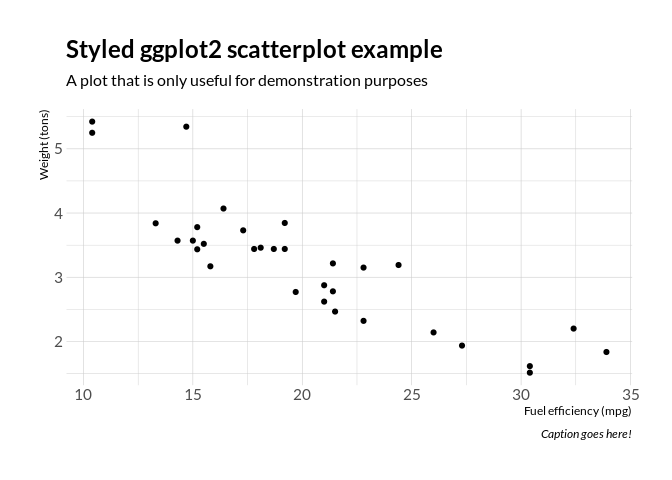
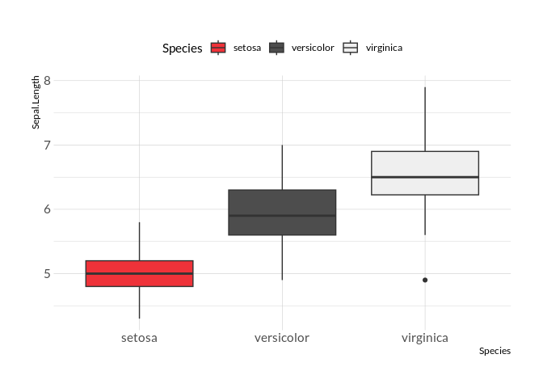
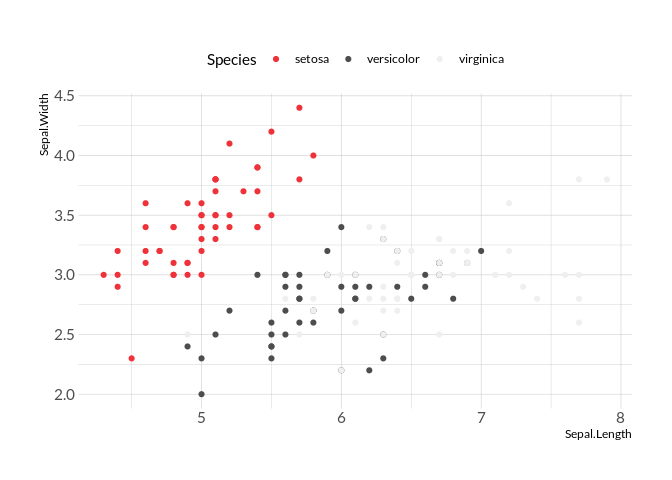
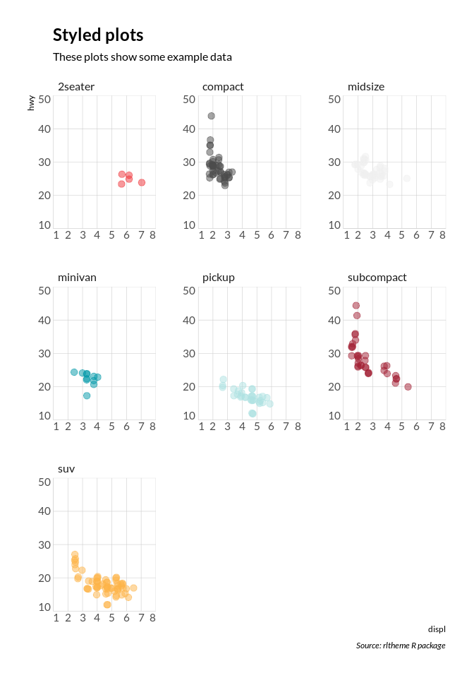
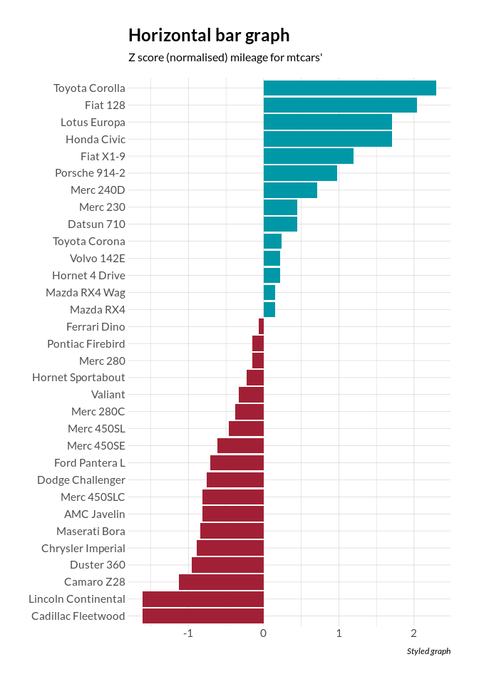
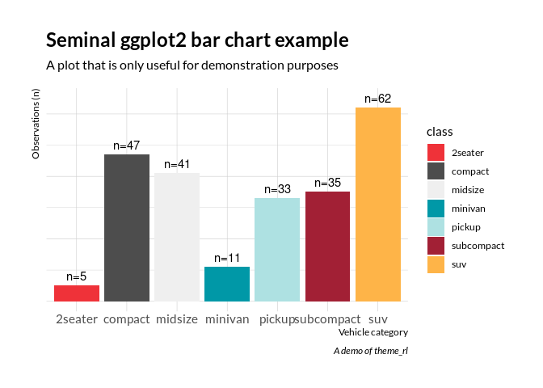

<!-- README.md is generated from README.Rmd. Please edit that file -->

# rltheme

<!-- badges: start -->

<!-- badges: end -->

This is an R package providing some styling resources for web content
intended to align with the graphical profile used at Redpill-Linpro.

It is heavily inspired by <https://github.com/hrbrmstr/hrbrthemes>. Most
of the graphical design considerations, the package structure used and
the functions are either ripped directly or modified slightly from that
package adapting it to the Redpill-Linpro graphical profile.

The styling assets and resources are different, though (fonts,
templates, color palettes etc).

## Content

This package installs various styling assets as outlined below.

### Fonts

It includes fonts in the two main font families used in the graphical
profile:

  - Lato (Open SIL licensed font)
  - Georgia (MS font)

### Templates for rmarkdown content

Two templates are provided for styling `rmarkdown` authored content:

  - one for general HTML content with the CSS styles
  - one for PDF output

The HTML template uses a stylesheet (CSS file) harvested from
<https://redpill-linpro.com> on 2020-01-27 which has been “beautified”
with <https://www.cleancss.com/css-beautify/>.

This makes it possible to use the CSS when rendering rmarkdown content
into standalone HTML, but currently the rendering step requires some
patience due to the lag when some online assets are pulled in from the
web.

### Theme for ggplot2

It also provides a `theme_rl()` function which can be used to style
ggplots.

### Color palette

Finally, there is a set of color palettes based on the primary and
secondary signature colors for Redpill-Linpro. This color palette can be
used to color qualitative data, sequential data and diverging data.

  - qualitative palette for nominal or unordered categorical values
    (using the primary profile color (blue), followed by the secondary
    profile colors, each in three variants using 100%, 40% and 80% alpha
    respectively
  - sequential palette for quantitative magnitudes - high/low values -
    or for ordered categorical data (the primary color in 5 stepped
    variations - using varying levels of alpha)
  - diverging palette for use with quantitative values centered around
    some point - or centered ordered categorical data (the primary color
    is used on one end of the palette and the closest complement color
    on the other to provide a 7-color palette with three steps of blue,
    a gray midpoint and three steps of red)

## Installation

You can install the development version of `rltheme` from
[GitHub](https://github.com/) with:

``` r
# install.packages("devtools")
devtools::install_github("mskyttner/rltheme")
```

## Usage

A helper function is availble for system-wide install of fonts on Linux
OSes:

``` r
# install from https://github.com/mskyttner/rltheme
library(rltheme)
install_fonts_linux()

library(extrafont)
extrafont::loadfonts()

# required in the following usage examples 
library(dplyr)
library(ggplot2)
library(Cairo)
```

Here are usage examples showing plots made using the different color
palettes and the Lato font.

A plain vanilla scatter plot:

``` r
ggplot(mtcars, aes(mpg, wt)) +
  geom_point() +
  labs(x="Fuel efficiency (mpg)", y="Weight (tons)",
    title="Styled ggplot2 scatterplot example",
    subtitle="A plot that is only useful for demonstration purposes",
    caption="Caption goes here!") + 
  theme_rl()
```



Using the palette, qualitative coloring:

``` r

ggplot(iris, aes(Species, Sepal.Length)) + 
  geom_boxplot(aes(fill = Species)) +
  scale_fill_rl() +
  theme_rl() +
  theme(legend.position = "top")
```



``` r

ggplot(iris, aes(Sepal.Length, Sepal.Width)) + 
  geom_point(aes(color = Species)) +
  scale_color_rl() +
  theme_rl()+
  theme(legend.position = "top")
```



Another example using demo data:

``` r
ggplot(mpg, aes(displ, hwy)) +
  geom_jitter(aes(color=class, fill=class), size=3, shape=21, alpha=1/2) +
  scale_x_continuous(expand=c(0,0), limits=c(1, 8), breaks=1:8) +
  scale_y_continuous(expand=c(0,0), limits=c(10, 50)) +
  scale_color_rl() +
  scale_fill_rl() +
  facet_wrap(~class, scales="free") +
  labs(
    title="Styled plots",
    subtitle="These plots show some example data",
    caption="Source: rltheme R package"
  ) +
  theme_rl(grid="XY", axis="xy") +
  theme(legend.position="none") -> gg

flush_ticks(gg)
#> theme(axis.text.x=element_text(hjust=c(0, rep(0.5, 6), 1))) +
#> theme(axis.text.y=element_text(vjust=c(0, rep(0.5, 3), 1)))
```



Diverging colors:

``` r
cars <- 
  mtcars %>%
  mutate(brand = rownames(mtcars)) %>%
  mutate(mpg_z_score = (mpg - mean(mpg, na.rm = TRUE)) / sd(mpg)) %>%
  mutate(mpg_type = ifelse(mpg_z_score < 0, "below", "above")) %>%
  mutate(CarBrand = factor(mpg_type, levels = unique(mpg_type)))

pdiv <- palette_rl(n = 7, type = "div")[c(1, 7)]
names(pdiv) <- NULL

ggplot(cars, aes(x=reorder(brand, mpg_z_score), y=mpg_z_score, label=mpg_z_score)) +
  geom_bar(stat='identity', aes(fill=mpg_type)) +
  scale_fill_manual(name="Mileage (deviation)",
    labels = c("Above Average", "Below Average"),
    values = c("above" = pdiv[1], "below" = pdiv[2])) +
  labs(subtitle="Z score (normalised) mileage for mtcars'",
    title= "Horizontal bar graph", caption="Styled graph") +
  theme_rl() +
  theme(
    axis.title.y=element_blank(),
    axis.title.x=element_blank(),
    legend.position="none"
  ) +
  coord_flip()
```



A narrow or condensed variant of Open Sans is available.

``` r
#update_geom_font_defaults(family=font_lato)
#import_lato()
#extrafont::loadfonts()

# library(readr)
# ft <- read_csv(system.file("fontmap", "fonttable.csv", package="extrafontdb"))
# regular_osc <- ft %>% filter(FamilyName == "Open Sans Condensed") %>% head(1)
# regular_osc$FullName <- "Open Sans Condensed"
# regular_osc$Bold <- FALSE
# ft_new <- bind_rows(ft, regular_osc)
# write_csv(ft_new, path = system.file("fontmap", "fonttable.csv", package="extrafontdb"))

library(dplyr)
library(ggplot2)

count(mpg, class) %>%
ggplot(aes(class, n)) +
geom_col(aes(fill = class)) +
geom_text(aes(label=paste0("n=", n)), nudge_y=3) +
labs(x="Vehicle category", y="Observations (n)",
     title="Seminal ggplot2 bar chart example",
     subtitle="A plot that is only useful for demonstration purposes",
     caption="A demo of theme_rl") +
theme_rl() +
scale_fill_rl() +
theme(axis.text.y=element_blank())
```


