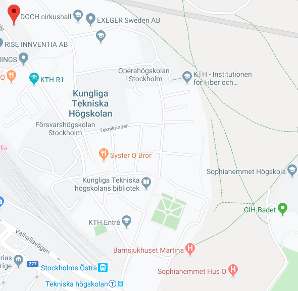
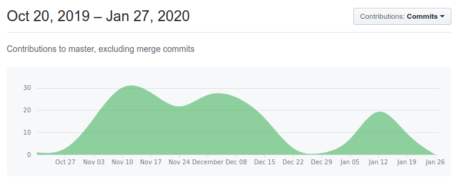
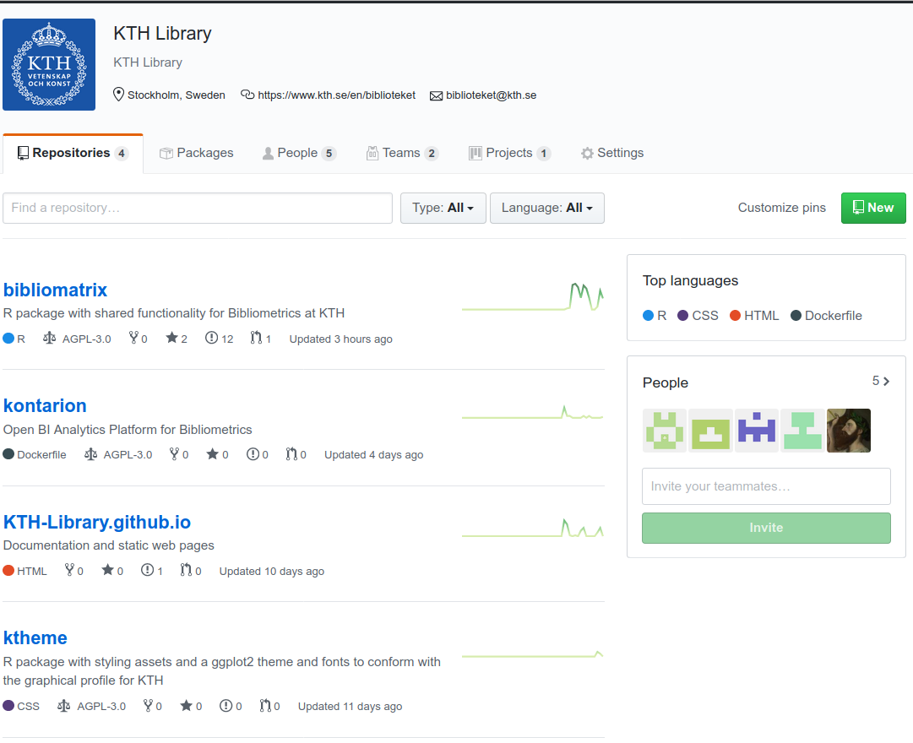

```{r setup, include=FALSE}
knitr::opts_chunk$set(echo = FALSE)

red <- tolower(rltheme::palette_rl(1))

emphasize <- function(txt) 
  sprintf("<font color='%s'>\n%s\n</font>", red, txt)
```

# {data-background=assets/rl-gradient-bg.png data-background-size=cover}

<center>

{width=400}

</center>

## {.flexbox .vcenter}

> __Uppdraget: Vad, Var, När, Hur?__

Årlig Bibliometrisk Uppföljning på KTH / "Annual Bibliometric Monitoring"

<center>

[{width=400}](https://www.google.com/maps/place/59%C2%B021'05.3%22N+18%C2%B004'02.1%22E/@59.3481525,18.0685303,16z/data=!4m5!3m4!1s0x0:0x0!8m2!3d59.351479!4d18.067243?hl=en-US)

</center>

KTH's Bibliotek och IT-Avdelningen, Okt 2019 - Mars 2020 (6 mån)

## Uppdraget {data-background=assets/bg/glasses.png data-background-size=cover}

- KTH's bibliotek har en `r emphasize("__Bibliometrigrupp__")` med forskare och analytiker
- Utvärdering av __forskningsoutput__ från lärosäten
  - Arbetar med KTH internt - `r emphasize("__årlig utvärdering__")` med alla anställda
  - Arbetar också externt med `r emphasize("__uppdrag från Vinnova__")` mm
- Data: Publikationer och beräknade __indikatorer__ såsom sampublicering, citeringsgrad mm
- Samverkar med KTH's `r emphasize("__IT-avdelning__")` (Dev+Ops)

##

```{r}
knitr::include_url("abm.html", height = 500)
```

## Arbetssätt {data-background=assets/bg/office-workspace.png data-background-size=cover}

- Projektledare från HiQ, agilt projekt
- `r emphasize("__2-veckors sprintar__")` (kommunikation: GitHub, Trello, Slack)
- `r emphasize("__Demo-möten__")` (styrgrupp med KTHs ledning) med publik rapportering på https://KTH-Library.github.io
- `r emphasize("__Integrationer__")` mot KTH's IT-miljö (MS SQL Server och SAML, LDAP)

## GitHub Flow {data-background=assets/bg/stadium.png data-background-size=cover}



## {data-background=assets/bg/stadium.png data-background-size=cover}

<center>

{height=600}

</center>

## Existerande lösningar {data-background=assets/bg/structures.png data-background-size=cover}

Licensbaserade lösningar existerar inkl diverse produkter från QlikTech, TIBCO Spotfire, Tableau, Cognos, SAS mm.

Önskemål:

- En lösning med `r emphasize("__mindre vendor lock-in__")` och enklare licenshantering. 
- En `r emphasize("__öppen plattform__")` baserad på containers, som gör det enkelt att jobba med exv R och Python, ML och AI, GitHub och DockerHub. 
- Specifikt stöd för `r emphasize("__ML och AI__")` för Big Data / Fast Data, exv kopplad till Apache Spark

## Teknisk lösning {data-background=assets/bg/plant.png data-background-size=cover}

Open source-baserad plattform för analytics - [KONTARION](https://github.com/kth-library/kontarion): 

- Klarar __ML och AI__, samt skalar i molnet med Docker Swarm / Kubernetes, den är container-baserad och stödjer ML med R, Python mm... Kan även GPU-skalas.

- En __autobuild__ sker när källkoden uppdateras och den nya imagen finns då tillgänglig från Docker Hub.

- __Docker Hub__ har binärerna/images: https://hub.docker.com/r/kthb/kontarion

[](https://github.com/kth-library/kontarion)

# Tack! Frågor?

## Komponenter {data-background=assets/bg/bridge.png data-background-size=cover}

Denna container-baserade "software stack" utökar https://www.rocker-project.org/ med domänspecifik funktionalitet för Bibliometrisk "analytics".

En komponent som ingår i KONTARION är en web-baserad miljö för att skapa analytics som baserar sig på RStudio Open Source Edition (AGPL v3), här är en lista på några andra kundcases där detta används: https://rstudio.com/about/customer-stories/

Det ingår även andra komponenter som behövs i en komplett plattform för Open Source BI, såsom applikationsservrar (exv runtimes för Shiny och Dash), "jobs"/tasks, API-server, stöd för markdown-baserad authoring av analytics mm.

## Användare / Referenser / "Use cases" {data-background=assets/bg/plant.png data-background-size=cover}

Det finns ett stort Data Science community med miljoner av utvecklare och användare både inom akademisk sektor och inom näringslivet, med liknande "use cases" och tillämpningar, inklusive ML / AI:

- https://spark.rstudio.com/mlib/ (Spark Machine Learning lib!)
- https://blogs.rstudio.com/tensorflow/
- https://tensorflow.rstudio.com/
- https://www.r-bloggers.com/
- https://plot.ly/dash/
- https://shiny.rstudio.com/


